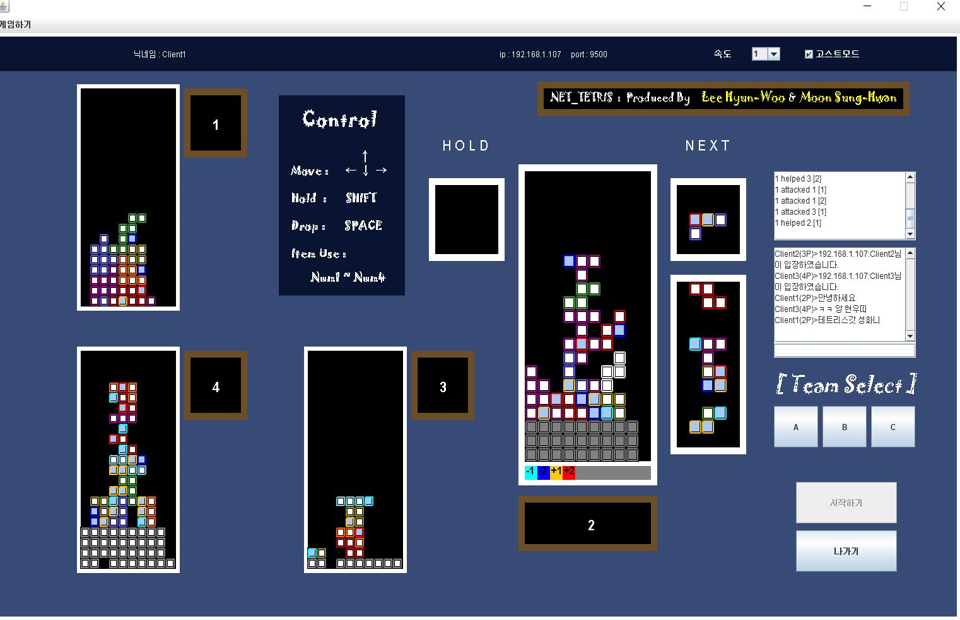

# java-multi-network-tetris

## 4인용 멀티 네트워크 배틀 테트리스

최대 4명이서 플레이 가능한 배틀 테트리스 게임입니다. 각 플레이어는 서로의 플레이 진행 상황을 플레이 중 실시간으로 확인할 수 있고 공격 및 방어를 할 수 있습니다.

## 1. 서버 클라이언트
플레이어의 역할에는 두 가지가 존재합니다.
1. 서버
2. 클라이언트

서버 플레이어는 자신의 ip와 포트를 개방하고 클라이언트 플레이어는 서버 플레이어의 ip와 port를 입력하고 연결합니다.

서버 플레이어 본인을 포함한 총 4명의 인원이 서로 연결되었다면 서버 플레이어가 시작하기 버튼을 클릭하여 게임을 시작합니다. 이때 더이상의 추가적인 클라이언트 연결은 받지 않습니다. 

서버 클라이언트는 각 클라이언트로부터 발생한 데이터를 브로드캐스팅 방식으로 네트워크에 전파합니다. 서버 클라이언트 본인이 발생시킨 데이터 또한 브로드캐스팅 방식으로 모든 클라이언트에 전송합니다.

## 2. 데이터

전송되는 데이터를 큰 분류로 분류하면 아래와 같습니다.

- 네트워크의 상태 (게임이 진행 유무, 네트워크 연결 상태 등)
- 서버 및 클라이언트의 동작 (메시지 입력, 상대방을 공격, 아이템 사용 등)
- 블록의 정보 (서버 및 클라이언트 플레이어의 블록 정보)

자세한 스펙은 `src/com.tetris/network/DataShip.java` 소스를 보면 확인 할 수 있습니다.

